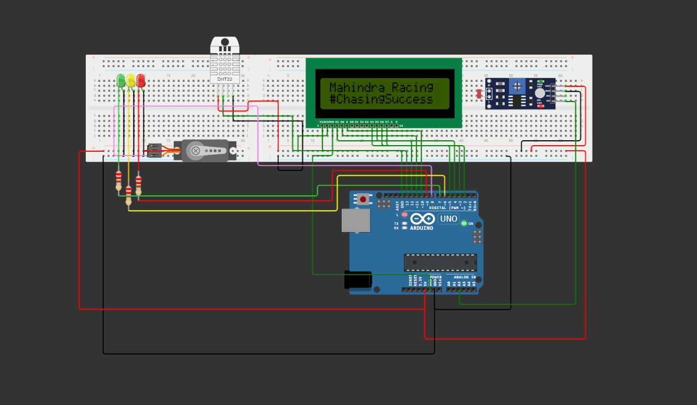

# SPRINT 1 - TECH MAHINDRA E FIAP

Este trabalho foi realizado como parte da **Sprint 1** da disciplina de **Edge Computing & Computer Systems**, direcionada aos alunos do primeiro semestre do curso de **Engenharia de Software da FIAP**. O principal objetivo desta Sprint foi criar uma solução IoT que pudesse coletar dados sobre a Fórmula E e transmiti-los de forma inovadora e fácil de entender, permitindo que pessoas de todas as idades e níveis de familiaridade com automobilismo possam se envolver e se empolgar com a competição.

## Descrição do Projeto

O projeto envolve um dispositivo instalado no cockpit dos carros da Fórmula E, que monitora e alerta sobre condições desfavoráveis como temperatura, umidade e luminosidade. Além disso, o sistema pode ativar automaticamente um compartimento de ventilação e resfriamento para otimizar o ambiente interno do carro. Este dispositivo IoT, integrado ao cockpit do piloto, coleta e processa dados críticos em tempo real, garantindo a segurança e o conforto do piloto ao longo da corrida.

  

## Funcionalidades Principais do Sistema

- Monitoramento da temperatura, umidade e luminosidade dentro do cockpit.
- Abertura automática do compartimento de ventilação e resfriamento em caso de temperatura elevada.
- Exibição das informações de temperatura e umidade em um display LCD.
- Indicação visual de alertas por meio de LEDs de diferentes cores.
- Controle de um servomotor para abrir e fechar o compartimento de ventilação e resfriamento.

## Nosso Objetivo

A segurança dos pilotos é uma prioridade em corridas de alta velocidade como a Fórmula E. Condições internas desfavoráveis, como calor extremo e alta umidade, podem comprometer o desempenho do piloto e até mesmo ameaçar sua vida. Portanto, é essencial implementar um sistema inteligente de monitoramento e controle para garantir um ambiente seguro e confortável durante as corridas.

 

  

## Componentes

### Lista de dispositivos utilizados nesse sistema:

- Um sensor de luz (fotoresistor) para medir a luminosidade ambiente.
- Um sensor de temperatura e umidade DHT22 para medir as condições dentro do cockpit.
- Três LEDs (vermelho, amarelo e verde) para indicar diferentes níveis de alerta.
- Um servomotor para abrir e fechar automaticamente o sistema de ventilação e resfriamento do cockpit.
- Um display LCD para exibir as informações ao piloto.
- Um Arduino Uno R3 para controlar todos os componentes.

 

## Instalação e Uso

### Para utilizar o sistema, siga as etapas abaixo:

1. Monte os componentes seguindo a imagem fornecida pelo circuito ou através do link do [simulador](https://wokwi.com/projects/400912299707834369) no **Wokwi**.
2. Importe todas as bibliotecas necessárias **(como LiquidCrystal, DHT e Servo)**.
3. Carregue o código-fonte para o **Arduino Uno R3**.
4. Ligue o sistema e monitore as condições ambientais durante a corrida.

 

## Circuito Final

## Participantes

- Arthur Amaral: RM556951
- CAUE GARAUDE: RM554838
- LUIZ HENRIQUE: RM556001
- Rafael Jango: RM555297
- Rafael Bocchi: RM557603

## Referências

- [Link do Circuito](https://wokwi.com/projects/400912299707834369)

## Licença

Este projeto está licenciado sob a [MIT License](LICENSE).

## Direitos Reservados

Todos os direitos reservados à FIAP ©️

  

